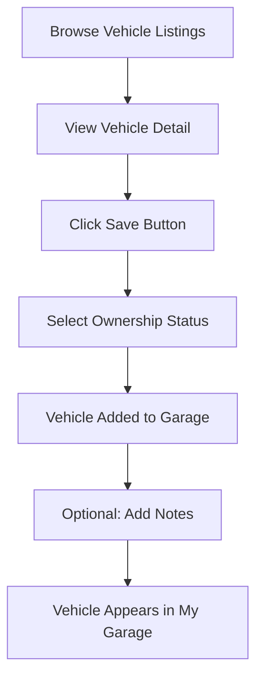
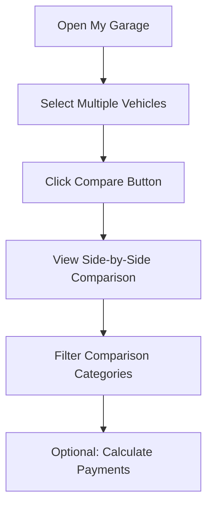
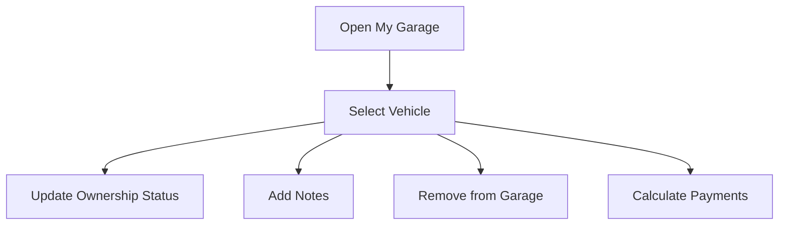

# My Garage: User Experience Guide

## Overview

My Garage is a personalized vehicle management system within the MotorTrend platform that allows users to save, organize, compare, and track vehicles they own, are interested in, or have test-driven. This comprehensive guide explains the functionality, user journeys, and implementation details of the My Garage feature.

## Core Functionality

### 1. Vehicle Management

Users can add vehicles to their garage in three categories:

- **Owned** - Vehicles the user currently owns
- **Test Drive** - Vehicles the user has test-driven
- **Interested** - Vehicles the user is considering

Each vehicle in the garage includes:

- Basic information (make, model, year, price)
- Technical specifications (engine, drivetrain, MPG)
- User-added notes and ownership status
- Saved date and last update timestamps

### 2. Vehicle Comparison

Users can:

- Select multiple vehicles to compare side-by-side
- View detailed specification comparisons
- Highlight differences between vehicles
- Filter comparison by category (performance, safety, etc.)

### 3. Payment Calculator

Integrated tools allow users to:

- Calculate monthly payments for vehicles
- Adjust down payment, term length, and interest rate
- Compare payment scenarios across different vehicles

### 4. Recommendations

The system provides personalized recommendations:

- "Cars You May Like" based on garage contents
- Similar vehicles in different price ranges
- Notifications about new models similar to saved vehicles

## User Interface Components

### 1. My Garage Skinny Component

**Purpose:** Provides a compact view of the user's garage on profile and other pages

**Implementation:**

```tsx
<MyGarageSkinny />
```

**Features:**

- Shows up to 3 saved vehicles with thumbnails
- Displays vehicle name and price
- Links to full garage view
- Shows empty state with CTA when no vehicles are saved

### 2. Garage Content Component

**Purpose:** Main component for the full garage experience

**Implementation:**

```tsx
<GarageContent />
```

**Features:**

- Tabbed interface for filtering by ownership status
- Search and filtering capabilities
- Vehicle comparison tools
- Payment calculator integration

### 3. Garage Header Component

**Purpose:** Provides consistent branding and introduction to the garage

**Implementation:**

```tsx
<GarageHeader />
```

**Features:**

- Welcome message
- Garage icon and branding
- Brief explanation of garage functionality

## User Journeys

### Journey 1: Adding a Vehicle to Garage



**Implementation Details:**

1. The save button appears on all vehicle cards and detail pages
2. Clicking save triggers the `useCardSave` hook
3. The hook calls `addSavedItem` from the `SavedItemsContext`
4. The vehicle is stored in localStorage and appears in the garage
5. User earns points for adding vehicles to their garage

### Journey 2: Comparing Vehicles



**Implementation Details:**

1. Users select vehicles using checkboxes in the garage
2. The `GarageComparisonSection` component renders the comparison table
3. The `CarComparisonTable` displays specifications side by side
4. Users can toggle different specification categories
5. Integration with the payment calculator allows financial comparison

### Journey 3: Managing Garage Vehicles



**Implementation Details:**

1. Each vehicle card has an action menu
2. The `updateSavedItem` function in `SavedItemsContext` handles updates
3. Changes are persisted to localStorage
4. User activity is tracked for each action

## Mobile Optimization

Following our mobile-first approach, the My Garage experience is fully optimized for mobile devices:

### Mobile Design Considerations

1. **List vs. Grid Layout:**

   - Mobile view uses a vertical list layout for vehicles
   - Desktop uses a grid layout with more visible information

2. **Touch Interactions:**

   - Larger touch targets for vehicle selection
   - Swipe gestures for quick actions
   - Bottom sheet modals for comparison on small screens

3. **Progressive Disclosure:**

   - Essential information shown first
   - Expandable sections for detailed specifications
   - Optimized comparison view for small screens

## Visual Language

The My Garage components follow the MotorTrend design system:

1. **Typography:**

   - `typography-title` for garage header
   - `typography-caption` for vehicle names
   - `typography-caption-small` for vehicle details

2. **Colors:**

   - Neutral color tokens for backgrounds and text
   - MotorTrend red accent for actions and highlights
   - Semantic colors for status indicators

3. **Spacing:**

   - Consistent 32px (2rem) vertical spacing between sections
   - Responsive padding for different screen sizes

## Implementation Guide

### Adding the My Garage Feature

1. **Required Components:**

   ```tsx
   import { useSavedItems } from "@/contexts/SavedItemsContext";
   import MyGarageSkinny from "@/components/profile/MyGarageSkinny";
   import GarageContent from '@/components/garage/GarageContent';
   ```

2. **Saving a Vehicle:**

   ```tsx
   const { addSavedItem } = useSavedItems();
   
   // Example of saving a new car
   const saveVehicle = () => {
     addSavedItem({
       id: carData.id,
       title: carData.title,
       type: 'newCar', // or 'usedCar'
       imageUrl: carData.imageUrl,
       savedAt: new Date().toISOString(),
       metadata: {
         price: carData.price,
         year: carData.year,
         ownership: 'interested', // or 'owned', 'testDriven'
         // other car details
       }
     });
   };
   ```

3. **Displaying the Garage:**

   ```tsx
   // Compact view for sidebar or profile
   <MyGarageSkinny />
   
   // Full garage page
   <GarageContent />
   ```

### Best Practices

1. **Performance Optimization:**
   - Lazy load the full garage content
   - Use virtualized lists for large garages
   - Optimize images with responsive sizes

2. **State Management:**
   - Use the SavedItemsContext for all garage operations
   - Maintain consistent state updates
   - Implement proper cleanup in useEffect

3. **Accessibility:**
   - Ensure proper contrast ratios
   - Implement keyboard navigation
   - Use semantic HTML
   - Provide proper ARIA labels

## Example User Flows

### New User First-Time Experience

1. User browses vehicle listings
2. User clicks "Save" on a vehicle they're interested in
3. System prompts to select ownership status
4. Vehicle is added to garage
5. System shows a tooltip highlighting the garage feature
6. User is awarded "Garage Starter" achievement

### Power User Comparison Flow

1. User with multiple saved vehicles opens garage
2. User selects 3 vehicles to compare
3. System generates side-by-side comparison
4. User toggles between specification categories
5. User calculates payments for each vehicle
6. User updates notes on preferred vehicle
7. User shares comparison via email

## Testing Guidelines

When implementing or modifying the My Garage feature, ensure:

1. **Functionality Testing:**
   - Vehicles can be added, removed, and updated
   - Comparison works with different vehicle types
   - Payment calculator produces accurate results

2. **Responsive Testing:**
   - Verify layout on mobile, tablet, and desktop
   - Test touch interactions on mobile devices
   - Ensure comparison view is usable on all screen sizes

3. **Performance Testing:**
   - Measure load time with many saved vehicles
   - Test localStorage limits and fallbacks
   - Verify smooth animations and transitions

## Conclusion

The My Garage feature provides users with a powerful tool to manage their vehicle interests and make informed purchasing decisions. By following this guide, you can ensure a consistent, accessible, and user-friendly garage experience that aligns with the MotorTrend design system and enhances the overall user journey.
